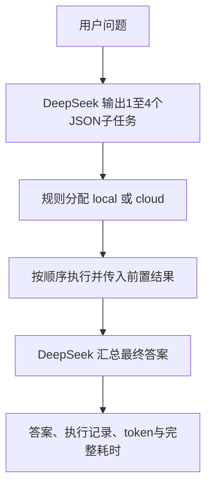

# 简化任务分解协作原型：老师演示说明

2026-10-02，真实模型联调完成。本原型演示如何让云端大模型拆解问题、AutoDL上的小模型处理子任务，再由云端汇总，并记录准确率、云端token与完整响应时间。它是参考DoT的简化实现，没有训练新模型，也不是完整DoT复现或多智能体辩论系统。

## 一分钟讲清楚

保留三条对照路径：local直接问小模型、cloud直接问云端、hybrid按整题关键词或长度选择模型。新增dot路径如下：



本地是AutoDL实例里的 Qwen3-4B-Q4_K_M，云端是DeepSeek官方 `deepseek-flash`，两者关闭思考模式。规则不额外调用分类模型，不保证准确识别难度。运行失败时有次数受限的升级/退化；答案错误本身不会自动触发升级。

## 现场演示命令（已实际运行）

在原AutoDL实例的JupyterLab Terminal执行：

```bash
cd /root/autodl-tmp/edge-cloud-prototype/prototype
/root/miniconda3/bin/python scripts/run_autodl.py ask '买12支笔，每支8元；买5本笔记本，每本14元。总价满150元减20元，只减一次。最终应付多少元？只输出整数。' --mode dot
```

入口仅在实例内读取私有密钥文件，并把密钥放入进程环境变量；不会打印或要求复制密钥。重复运行会产生少量云端调用费用。若实例重新开机，先在另一终端运行 `/root/miniconda3/bin/python scripts/start_autodl.py`，保持服务运行。

本次实际执行路径为 `cloud → local → local → local → local → cloud`，最终输出 **146**：

| 云端生成的子任务 | 规则分配及原因 | 本次执行结果（摘述） |
|---|---|---|
| 计算12支笔的总价 | local，default_local | 96元 |
| 计算5本笔记本的总价 | local，default_local | 70元 |
| 计算所有商品的总价 | local，default_local | 166元 |
| 判断满减条件并计算最终应付金额 | local，default_local | 146元 |

云端分解165 tokens，汇总281 tokens，合计446云端tokens；本地771 tokens单列。完整响应2199.39ms，无升级、无退化。记录见 [demo-ask.json](reports/dot-verified-20261002/demo-ask.json)。这是实验后单独验证的演示命令，未混入下面24请求对照；表中展示的是任务结果，不是模型内部思维链。

## 四组真实对照

运行前固定6道公开合成题、独立计算答案和严格评分，包含单步算术、多步购物/购水、预算选择、串行排程。每组同6题、各1次，temperature=0，最终max_tokens=512；dot规划最多512输出tokens、4个子任务。完整参数与哈希见 [EXPERIMENT_PROTOCOL.md](EXPERIMENT_PROTOCOL.md) 和原始 [protocol.json](reports/dot-verified-20261002/protocol.json)。

| 模式 | 严格准确率 | 请求成功率 | 云端总tokens | 平均完整响应ms | P50 ms | P95 ms | 升级/退化次数 |
|---|---:|---:|---:|---:|---:|---:|---:|
| local | 1/6（16.67%） | 100% | 0 | 192.22 | 78.80 | 491.38 | 0 / 0 |
| cloud | 4/6（66.67%） | 100% | 391 | 658.11 | 676.10 | 769.61 | 0 / 0 |
| hybrid | 2/6（33.33%） | 100% | 233 | 436.61 | 454.52 | 828.59 | 0 / 0 |
| dot | 4/6（66.67%） | 100% | 2155 | 1851.73 | 1864.21 | 2244.80 | 0 / 0 |

请求成功只表示接口正常返回，不代表回答正确。评分只宽容Unicode、大小写、首尾空白和句末标点，附带解释仍按错计。本轮local的d02/d03虽算出正确数值，但未遵守只输出整数；另有实际答错。

| 题号 / 标准答案 | local | cloud | hybrid | dot |
|---|---|---|---|---|
| d01 / 42 | 42 ✓ | 42 ✓ | 42 ✓ | 42 ✓ |
| d02 / 146 | 146附解释 × | 146 ✓ | 146附解释 × | 146 ✓ |
| d03 / 60 | 60附解释 × | 12 × | 12 × | 60 ✓ |
| d04 / B | A × | A × | A × | A × |
| d05 / 43 | 35 × | 43 ✓ | 56 × | 43 ✓ |
| d06 / AB | AC × | AB ✓ | AB ✓ | BC × |

完整回答保存在 [requests.jsonl](reports/dot-verified-20261002/comparison/requests.jsonl)，统计见 [summary.json](reports/dot-verified-20261002/comparison/summary.json)。没有事后修改答案、评分或挑选题目。

## 拆解的开销是否值得

| dot阶段，6题合计 | 云端调用 | 云端tokens | 本地调用 / tokens | 该阶段调用耗时之和ms |
|---|---:|---:|---:|---:|
| 分解 | 6 | 1012 | 0 / 0 | 5085.65 |
| 顺序执行 | 0 | 0 | 20 / 3291 | 1751.92 |
| 汇总 | 6 | 1143 | 0 / 0 | 4265.25 |
| 退化 | 0 | 0 | 0 / 0 | 0 |

这6题中，规则将20个子任务全部分给小模型，没有强制制造local/cloud混合执行。分解与汇总已经消耗2155云端tokens，高于直接cloud的391；dot平均响应也更慢，而严格准确率同为4/6。因此本轮展示了编排和计量可运行，**没有证明拆解能够省token或加速**。简单短题可能不值得承担额外的规划与汇总开销。

24请求对照合计2779云端tokens；另有生成预检27、独立演示446，合计3252云端tokens、24次实际云端生成调用。本地预热另存且不计云端用量。这些是API报告用量，不是账单金额。

## 已完成与局限

- 已完成四模式CLI、结构化分解、规则分配、顺序前置结果、有限升级/退化、完整调用记录、真实四组对照和独立报告审计。AutoDL Linux 37项单元测试全部通过；Windows35项通过、2项按平台跳过。
- dot每次system+user输入上限9000 UTF-8字节，超限不截断；记录并尝试一次整题退化，原题仍超限则停止。这个工程预算不等同本地4096 token窗口。
- 计时从AutoDL客户端开始调度到答案全部返回，包含本地推理和网络；排除模型启动、Windows SSH传输、独立云端预检和本地预热。应用缓存关闭，但llama.cpp前缀KV缓存及供应商缓存未控制。
- 只有6题×1轮，P95只是样本统计，不能证明稳定性、统计显著性或论文效果。模型别名也不代表供应商权重永远固定。
- 未完成标准基准、大样本重复实验、可靠难度分类器、隐私机制、工具调用及多轮辩论。下一步先与老师确认正式指标和题集，再评估哪些任务值得拆解，并研究预算路由；本次不自动扩大付费实验。

实例 `6fcb40b7f5-2694e599` 在交付检查时仍运行，按量计费。创建时报价1.14元/小时，实际账单以平台为准；演示后可在控制台关机。
