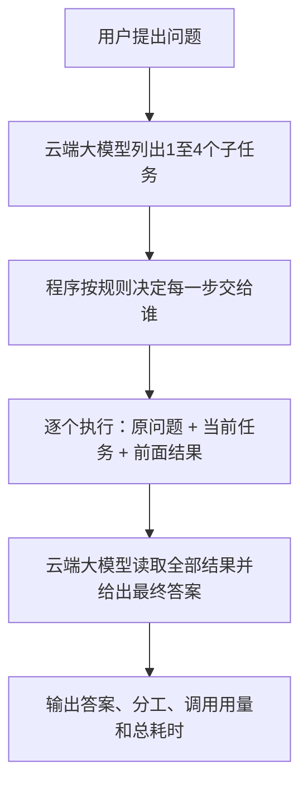

# 给组员看的说明：我们这个原型到底在做什么

这份文档帮助大家理解项目思路和当前进度。代码、例子和数据对应2026年10月2日完成的这一版；实验结果来自真实模型调用。

**阅读顺序：** 想理解思路先看第1～7节；想马上运行看第8～10节；看不懂输出看第11节；准备改代码看第12节；运行报错看第13节。本文中的AutoDL命令在实例的Linux终端执行，Windows命令另有标注。

## 1. 我们想弄清楚的问题

假设一个问题既有简单计算，又有条件判断。我们想试试：能不能让大模型先把事情拆清楚，再把一部分工作交给小模型，最后由大模型整理答案？这样是否能在尽量答对的情况下，减少大模型的使用量，或者缩短等待时间？

这是要验证的想法，不是已经得到的结论。因此初版先把完整流程搭起来，让每一次模型调用都有记录，再拿几种做法作对照。

老师关心的三个指标，在程序里对应：**答对多少、用了多少云端token、从提问到完整回答等了多久**。token可以理解为模型处理文本时使用的计量单位，它与字数不一一对应，也不直接等于费用。

## 2. 谁负责什么

| 组成 | 当前用什么 | 负责什么 |
|---|---|---|
| 小模型 | AutoDL上的Qwen3-4B量化模型 | 回答分给它的问题或子任务 |
| 云端大模型 | DeepSeek API，`deepseek-flash`，关闭思考模式 | 拆任务、执行分给它的任务、汇总答案 |
| 调度程序 | 我们写的Python代码 | 发请求、按规则分工、传递结果、处理失败、记录指标 |

项目里的“local”指AutoDL实例里的小模型，不是大家笔记本上的模型。我们目前没有训练新模型，而是在已有模型上搭协作流程。

## 3. 一个问题怎么走完整个流程

新增的`dot`模式借鉴了DoT的任务分解思路，目前只做简单的顺序执行。



用已经实际运行过的购物题说明：

> 买12支笔，每支8元；买5本笔记本，每本14元。总价满150元减20元，只减一次。最终应付多少元？

**第一步，让云端拆任务。** 云端返回一个程序能直接读取的列表。这次它拆成四步：计算笔的总价、计算笔记本总价、计算商品总价、判断满减后应付多少。

**第二步，程序分工。** 初版规则很简单：任务文字达到300个字符，或者包含“证明”“多步推理”“约束规划”“编写代码”等配置关键词，就交给云端；否则交给小模型。它只是文字规则，不会真正判断题目难度。购物题这四步都被分给了小模型。

**第三步，按顺序做。** 每一步都收到原题、自己的任务和前面已经得到的结果。比如算总价时，能够看到前面算出的96元和70元。现在不并行，也没有复杂的任务依赖图。

| 顺序 | 小模型接到的任务 | 本次得到的结果 |
|---|---|---|
| 1 | 计算笔的总价 | 12×8＝96元 |
| 2 | 计算笔记本总价 | 5×14＝70元 |
| 3 | 计算商品总价 | 96＋70＝166元 |
| 4 | 判断满减并计算应付金额 | 166－20＝146元 |

**第四步，云端汇总。** 云端拿到原题和四步结果，最终按题目要求只输出`146`。汇总仍然是一次模型调用，也可能答错；它不是一个能够保证正确的验算器。

这个例子实际走了“云端 → 小模型 → 小模型 → 小模型 → 小模型 → 云端”，用时约2.20秒，云端用量446 tokens。这里展示的是子任务和返回结果，不是模型内部思维链。原始记录见[这次演示输出](reports/dot-verified-20261002/demo-ask.json)。

## 4. 为什么还留着另外三种模式

如果只跑分解协作，就不知道多做这些步骤有没有价值。因此我们在同一批题上比较四种方法：

| 模式 | 做法 | 用来回答什么问题 |
|---|---|---|
| `local` | 整道题直接问小模型 | 小模型自己能做到什么程度？ |
| `cloud` | 整道题直接问云端 | 直接用大模型的效果和开销是多少？ |
| `hybrid` | 程序按规则给整道题选模型 | 只做整题分流是否已经够用？ |
| `dot` | 先拆任务，再逐步分配，最后汇总 | 更细的分工能否抵消额外调用的开销？ |

`hybrid`与`dot`最主要的区别是分配对象：前者分配整道题，后者分配拆出来的每一步。现在这两者用的都是简单规则。

## 5. 出错了怎么处理，消耗怎么算

云端成功返回内容、但任务列表格式不合格时，程序会放弃这份列表，再让云端直接回答原题一次。小模型某一步调用失败时，最多把这一步交给云端补做一次。真正的云端调用失败则停止并记录错误，不会一直重试。

这里的“失败”指接口报错、超时、没有有效回答等。**模型正常返回了一个错误答案，目前不会被程序自动发现。** 所以“请求成功率100%”不代表“答对率100%”。

每一步携带的输入也有上限：system提示与用户输入合计9000个UTF-8字节。超出时会明确记录，并尝试一次云端整题回答；原题也超限就停止。程序不会偷偷删掉前面结果。这个字节上限只是工程限制，不等同模型的token窗口。

统计时，分解、云端子任务、失败后升级、汇总、退化产生的云端用量全部计入；小模型token另记。接口没有返回usage时写“未知”，不会写成零。总耗时从程序开始处理到最终返回，包含中间小模型计算和网络等待，不只是大模型生成时间。

## 6. 第一轮实际测出了什么

我们固定了6道合成题，覆盖简单算术、多步计算、预算选择和排程。答案用普通算术和组合枚举独立核对，没有拿待测模型自己的答案当标准。每种模式各做一次，合计24个完整请求。

| 模式 | 严格答对 | 云端总token | 平均完整响应 |
|---|---:|---:|---:|
| local | 1/6 | 0 | 192ms |
| cloud | 4/6 | 391 | 658ms |
| hybrid | 2/6 | 233 | 437ms |
| dot | 4/6 | 2155 | 1852ms |

24个请求都成功返回，但有错误答案，也有不按格式回答的情况。我们事先要求只输出答案，因此算对数值却附带解释，也按严格评分计错。例如小模型有两题属于这种情况；不能把1/6简单理解成它只有一道题会算。

本轮dot的20个子任务全部被规则分给了小模型，云端仅做分解和汇总。即便如此，分解用了1012云端tokens，汇总用了1143，合计仍明显高于直接问云端的391。dot与cloud都答对4题，dot却花了更多token和时间。

**目前能够说的是：流程和计量已经跑通；在这批短题上，拆解没有带来节省或加速。** 我们没有为了让结果好看去改答案、改评分，或者只展示成功题。六题单轮只能作演示，不能推断其他任务上的效果。详细数字和错误答案见[老师演示说明](TEACHER_DEMO.md)。

## 7. 大家接下来怎么接着做

现在已有可运行CLI、四种对照模式、调用记录、固定题集和真实报告。已有验证记录中，AutoDL Linux的37项测试全部通过。完整DoT复现、多智能体辩论、训练难度分类器和隐私机制都还没有做。

下一步最值得讨论的是：**什么情况下值得拆，什么情况下直接回答更合算？** 可以先扩大经过独立核对的题集，再观察错误主要发生在分解、分工、执行还是汇总。之后再研究更合理的路由和调用预算，而不是默认每个问题都拆成多步。

建议大家按下面的顺序看项目：

1. 先读本文，理解目标和流程。
2. 读[老师演示说明](TEACHER_DEMO.md)，看实际例子和完整结果。
3. 需要运行时看[README](README.md)，里面有已验证的AutoDL命令。
4. 想改编排就看[system.py](edge_cloud/system.py)，想看接口请求和usage就看[client.py](edge_cloud/client.py)，想改评测就看[evaluation.py](edge_cloud/evaluation.py)。

密钥只保存在AutoDL的私有运行目录里。组员共享代码和公开实验报告即可，`runtime/`、密钥、虚拟环境和模型文件不进入GitHub。运行真实模型会产生资源或API费用；离线模拟只能验证流程，不能当作模型实验结果。

## 8. 第一次上手：先分清自己在哪台机器上

项目目前是命令行程序，没有聊天网页。你在终端输入命令，程序执行完一次任务后输出JSON并退出；小模型服务则需要一直运行，等待下一次请求。

| 你想做什么 | 在哪里操作 | 需要什么 |
|---|---|---|
| 跑真实小模型和端云协作 | 已部署好的AutoDL实例 | 实例访问权限、小模型服务；云端模式还要实例内已有密钥 |
| 看代码、跑单元测试、体验模拟流程 | 自己的Windows电脑 | 项目文件、Python 3.10或更高版本 |
| 从零部署另一台GPU服务器 | 新服务器 | GPU、构建环境、模型下载和云端配置，按README另行部署 |

**组员日常优先用已有AutoDL实例。** 拿到代码或ZIP不等于拿到了模型：交付物里没有数GB的模型权重、运行二进制或密钥。不要在笔记本上照搬GPU部署步骤。

### 8.1 在已有AutoDL实例启动

先由项目负责人提供实例的访问方式。在AutoDL控制台找到原项目实例，进入JupyterLab，再打开Terminal。若实例已关机，先与负责人协调开机和费用；本文不要求新租实例。

**第一步：进入实际项目目录。**

```bash
cd /root/autodl-tmp/edge-cloud-prototype/prototype
/root/miniconda3/bin/python --version
```

下面的Linux命令都以这个目录为起点。这里使用实例已安装的Python绝对路径，避免终端默认`python`指向其他环境。

**第二步：检查小模型是否已经在运行。**

```bash
curl --max-time 5 http://127.0.0.1:8000/health
```

如果返回包含`"status":"ok"`的JSON，直接进入第三步，不要重复启动。连接被拒绝通常表示服务没启动；如果提示正在加载，就等待加载结束后再检查，不能同时再开一个服务。

确认服务未启动时，在当前终端执行：

```bash
/root/miniconda3/bin/python scripts/start_autodl.py
```

它会读取已有的`runtime/deployment.json`，加载已经部署好的模型，并在`127.0.0.1:8000`监听。**这是前台服务，终端一直显示日志是正常现象。保持这个终端打开，再新开第二个Terminal执行提问命令。** 第二个终端也要先`cd`进入项目目录。

如果缺少`runtime/deployment.json`，说明当前路径或部署状态不对，不是“再运行一次启动命令”就能解决。先联系负责人确认；全新环境的安装步骤见[README](README.md)的“首次部署或在新实例复现”。已有实例不需要每次重新下载和编译。

**第三步：检查云端配置和模型列表。**

```bash
/root/miniconda3/bin/python scripts/run_autodl.py doctor
```

正常情况下，输出中的`local.status`和`cloud.status`都为`ready`。这个入口会读取`config.deepseek.example.json`，并从实例私有文件载入密钥，不需要组员在命令中输入密钥。

`doctor`只检查模型列表，不发送聊天生成请求。它通过之后，还要用下一步的真实问题确认能生成；余额、生成权限等问题可能到生成时才暴露。

**第四步：先跑一个小问题，再跑完整协作。**

先只问小模型，这条命令不需要云端密钥：

```bash
/root/miniconda3/bin/python -m edge_cloud --config config.deepseek.example.json ask '17加25等于多少？只输出整数。' --mode local
```

再运行已验证过的分解协作例子，会调用云端API：

```bash
/root/miniconda3/bin/python scripts/run_autodl.py ask '买12支笔，每支8元；买5本笔记本，每本14元。总价满150元减20元，只减一次。最终应付多少元？只输出整数。' --mode dot
```

先看输出里的`success`和`answer`，再看`subtasks`。历史演示返回146，但模型后续运行的拆法、措辞和耗时可能不同。

### 8.2 没有实例权限，也能在Windows体验流程

Python应用和测试只使用标准库，不需要为了看流程安装PyTorch、下载模型或复制API密钥。先打开PowerShell，进入你拿到的项目中的`prototype`目录。下面路径是本项目当前电脑上的实际路径；组员应换成自己的解压位置。

```powershell
cd 'D:\桌面\大创\大创2：基于大模型的多智能体讨论系统\prototype'
python --version
python -X utf8 -m unittest discover -s tests -v
```

再运行一次离线模拟：

```powershell
$demoOutput = 'reports/demo-' + (Get-Date -Format 'yyyyMMdd-HHmmss-fff')
python -X utf8 -m edge_cloud demo --dataset data/dot_smoke.jsonl --modes local cloud hybrid dot --output $demoOutput
```

模拟不访问模型服务，也不产生API生成费用。普通回复固定为42，dot的任务列表也是固定示例，所以不要拿模拟准确率评价模型。检查输出里`simulated: true`，它只是让你熟悉程序如何分工、统计和写报告。

若Windows有多个Python环境，可以用自己的虚拟环境解释器替换`python`。已有`.venv`是某台电脑的本地环境，不应从其他机器复制；至少确认版本达到3.10。

## 9. 日常怎么用：问一道题、换模式、保存结果

### 9.1 给同一道题切换模式

在AutoDL项目目录执行下面任意一条。四条的题目相同，只改变`--mode`：

```bash
/root/miniconda3/bin/python scripts/run_autodl.py ask '17加25等于多少？只输出整数。' --mode local
/root/miniconda3/bin/python scripts/run_autodl.py ask '17加25等于多少？只输出整数。' --mode cloud
/root/miniconda3/bin/python scripts/run_autodl.py ask '17加25等于多少？只输出整数。' --mode hybrid
/root/miniconda3/bin/python scripts/run_autodl.py ask '17加25等于多少？只输出整数。' --mode dot
```

`run_autodl.py`这个统一入口即使选择local，也会先读取密钥文件。若只想在没有云端配置时使用小模型，采用第8.1节的`python -m edge_cloud ... --mode local`命令即可。省略`--mode`时默认是hybrid，演示和实验建议明确写出模式。

一次`ask`只处理一个问题，不是多轮聊天；下一条`ask`不会自动记住上一条的问题。dot同一次请求内部会传递前置结果，这与跨请求聊天记忆是两回事。

### 9.2 保存一次提问的完整输出

`ask`默认只打印到终端。需要保存时，在AutoDL终端执行：

```bash
mkdir -p reports/manual
ask_record=$(mktemp reports/manual/ask-XXXXXX.json)
/root/miniconda3/bin/python scripts/run_autodl.py ask '17加25等于多少？只输出整数。' --mode dot > "$ask_record"
ask_status=$?
printf '结果文件：%s\n程序退出码：%s\n' "$ask_record" "$ask_status"
```

这会创建一个新文件，避免覆盖其他人的记录，并立即保存模型命令的退出码。0表示这次命令成功，2通常表示配置或请求失败；模型调用成功与否还要看JSON中的`success`，不能仅凭文件存在就判断成功。

组员在共享实例上尽量顺序演示：本地服务目前只有一个推理槽，同时跑实验会互相等待，也会影响时延数据。用完自己前台启动的服务，可在对应终端按Ctrl+C；不要停止其他组员正在使用的进程。停止模型进程不等于停止AutoDL实例计费，结束使用后由负责人协调是否关机。

## 10. 怎么跑一组正式对照

问一道题适合演示，比较不同方案则要保证题目、答案、参数和评分规则一致。首轮6题已经冻结，答案检查脚本会校验整份题集的哈希，修改题干也会导致校验失败。

在AutoDL项目目录，先运行不调用模型的答案检查：

```bash
/root/miniconda3/bin/python scripts/check_dot_dataset.py
```

如果要按原协议再跑一轮，确认本地服务和云端可用，并协调好API费用后执行：

```bash
experiment_output="reports/dot-$(date +%Y%m%d-%H%M%S)"
/root/miniconda3/bin/python scripts/run_dot_experiment.py --output "$experiment_output"
```

这个脚本依次做以下事情：记录配置和源码哈希；核对6题答案；检查两端模型列表；发送一次短云端生成并检查usage；本地预热一次；最后跑6题×4模式，共24个完整请求。dot内部还有多次模型调用，所以24个完整请求不等于24次API调用。

预检失败时不会开始对照。对照开始后，正常记录的单题失败会计入结果，继续其他题目；程序不会自动重跑整轮。输出目录必须是新目录，已有目录会被拒绝，以保留历史。

主要产物如下，均在`$experiment_output`下面：

| 文件 | 用来做什么 |
|---|---|
| `protocol.json` | 本轮模型、参数、源码和题集哈希 |
| `dataset-check.json` | 独立答案核对结果 |
| `doctor.json` | 本轮模型列表检查结果 |
| `cloud-probe.json`、`local-warmup.json` | 单独保存的云端生成预检和本地预热 |
| `comparison/requests.jsonl` | 每行一个完整请求，保留答案、评分和内部调用 |
| `comparison/summary.json` | 各模式准确率、成功率、用量、平均/P50/P95耗时 |
| `status.json` | 正常完成或预检/请求失败状态；意外中断时也可能尚未生成 |

历史目录里的`demo-ask.json`、`unit-tests.log`和`audit.json`是交付时另外生成的证据，并不是这个实验脚本自动生成的文件。

如果要增加题目，另建题集文件，例如`data/team_tasks.jsonl`，每行一个JSON对象：

```json
{"id":"team01","category":"simple","prompt":"17加25等于多少？只输出整数。","answers":["42"]}
```

题号不能重复，题干和答案不能留空。答案先由人或独立计算程序核对；要比较算法时先固定评分，不要看到回答后再放宽标准。新题集可用通用评测命令：

```bash
team_output="reports/team-$(date +%Y%m%d-%H%M%S)"
/root/miniconda3/bin/python scripts/run_autodl.py evaluate --dataset data/team_tasks.jsonl --modes local cloud hybrid dot --repeats 1 --output "$team_output"
```

这条命令假设你已经创建了上面的题集。通用`evaluate`直接开始评测，不自动执行生成预检、预热或固定协议哈希核对；它将`requests.jsonl`和`summary.json`直接写进输出目录，没有额外的`comparison/`层。正式实验需要另外记录自己的预检和冻结协议，不能把两种入口混为一谈。

## 11. 输出里的字段怎么看

不用一上来读完全部JSON。先看是否成功和答案，再追踪执行路径，最后看用量与耗时。

| 字段 | 人话解释 |
|---|---|
| `success` / `answer` | 程序是否拿到有效的最终回答，以及回答内容；成功不代表答对 |
| `mode` / `path` | 选了哪种模式、按先后顺序调用了哪些角色 |
| `subtasks` | 云端拆出的任务、分工原因、每步结果和状态 |
| `assigned_role` / `executed_role` | 最初分给谁、最后实际尝试由谁执行；尚未执行时后者可为null |
| `route_reason` | 分配依据，如`default_local`、`complex_keyword`或`long_prompt` |
| `calls` | 每次内部调用的模型、阶段、成功状态、usage和耗时 |
| `cloud_tokens` / `local_tokens` | 云端与本地分别累计的token；null表示未知，不能当零 |
| `known_cloud_tokens_subtotal` | 即使用量不完整，也保留已知的那一部分云端用量 |
| `elapsed_ms` | 请求最外层是完整响应耗时，单位毫秒；1000ms＝1秒 |
| `upgrade_count` / `degradation_count` | 本地失败后升级云端的次数、dot退回整题回答的次数 |
| `events` / `error` | 发生了什么异常处理、最终失败类型 |
| `simulated` | true表示模拟结果，不能作为真实模型证据 |

`calls`中的阶段名是`decompose`（分解）、`execute`（执行）、`aggregate`（汇总）、`fallback`（退化或原有hybrid升级调用）。例如dot子任务失败后换云端补做，调用仍记在execute阶段，同时增加升级计数。

阶段统计有一个需要特别区分的地方：`stage_metrics`里的`elapsed_ms`只累计该阶段云端调用时间；`all_call_elapsed_ms`才包含本地与云端。请求最外层的`elapsed_ms`包含整个流程及调度开销。不要用云端阶段耗时去冒充完整响应时间。

在评测文件中还会看到`task_id`、`experiment_id`、`repeat`和`correct`，用来关联题目、实验、重复轮次和严格评分。单次`ask`没有参考答案，因此不会自动给你一个`correct`。`fallback_rate`表示发生过升级或退化的请求比例，不是调用次数比例。

## 12. 程序内部怎么运作，想改功能该看哪里

一次真实请求的入口关系可以这样理解：

```text
scripts/run_autodl.py       读取实例私有密钥，指定DeepSeek配置
          ↓
edge_cloud/__main__.py      解析ask / doctor / evaluate及其参数
          ↓
edge_cloud/config.py        把配置读成程序对象
          ↓
edge_cloud/system.py        决定谁做、按什么顺序做、失败怎么处理
          ↓
edge_cloud/client.py        向模型发HTTP请求，取出回答、usage和错误状态
          ↓
system.py 汇总调用记录 → CLI输出JSON；评测时另由evaluation.py写入报告
```

小模型虽然是自己部署的，也提供一个HTTP聊天接口。调度程序向实例内的`http://127.0.0.1:8000/v1/chat/completions`发请求；向云端则请求`https://api.deepseek.com/chat/completions`。二者使用相近的消息格式，所以同一个客户端就能连接两边，不需要写两套编排逻辑。

dot的“规划”也只是一次云端模型请求：提示它输出JSON子任务列表，程序再检查格式、数量和空字符串。随后对每段**子任务文字**执行规则判断；原题和前置结果会作为执行上下文发送，但初版路由并不分析这些完整上下文。因此原题里有复杂关键词，也不保证拆出的每个任务都会上云。

每一步返回后，程序把结果追加到一个列表里，再传给下一步；最后把原题和结果列表交给云端汇总。各调用之间传的是文本结果，没有共享模型权重、没有训练过程，也没有多个模型相互辩论。中间错误可能被后面沿用，汇总模型也可能自行纠正或引入新错误。

| 文件或目录 | 负责什么 | 组员通常在什么情况下看它 |
|---|---|---|
| `edge_cloud/system.py` | 四种模式、路由、dot编排、预算和失败策略 | 调整分工规则或执行流程 |
| `edge_cloud/client.py` | HTTP调用、禁思考参数、真实usage、错误类型 | 排查接口兼容或计量问题 |
| `edge_cloud/config.py` | 参数默认值和校验 | 理解参数范围、增加可配置项 |
| `edge_cloud/evaluation.py` | 读题、评分、轮换顺序、汇总报告 | 修改实验方法和指标 |
| `edge_cloud/__main__.py` | CLI参数与模拟入口 | 增加命令或排查参数报错 |
| `config.deepseek.example.json` | 当前真实四模式配置，无密钥值 | 查看模型、超时、输出和上下文预算 |
| `config.example.json` | 默认仅本地配置 | 无云端环境下使用local |
| `scripts/start_autodl.py` | 启动已部署的小模型服务 | 实例重启后恢复推理服务 |
| `scripts/deploy_autodl.py` | 校验下载、编译和部署 | 首次部署，不是日常提问入口 |
| `tests/` | 假HTTP服务等测试 | 修改代码后验证行为，不依赖真实API |
| `data/` / `reports/` | 题集 / 模拟与真实记录 | 准备实验和分析结果 |

想调整规则时，优先在新的配置里明确记录`long_prompt_chars`和`complex_keywords`，避免偷偷改变历史实验条件。默认小模型示例的`max_tokens`是256，DeepSeek四模式示例是512；做对照要统一配置，不要用不同入口的默认参数混着比较。通用CLI的`--config`写在子命令前，例如`python -m edge_cloud --config config.deepseek.example.json ask ...`；AutoDL安全入口已经指定配置，无需重复传。

## 13. 常见问题怎么排查

| 看到的现象 | 先做什么 |
|---|---|
| `No module named edge_cloud` | 确认终端位于包含`edge_cloud/`的prototype目录，并使用正确Python环境 |
| 找不到`config.example.json` | 通用CLI从当前目录读取默认配置；先cd到prototype，或在子命令前指定真实配置路径 |
| 找不到`runtime/deployment.json` | 确认是已有部署目录；单独下载源码并不包含模型运行环境 |
| 本地健康接口连接失败 | 检查实例是否运行、小模型是否启动；已在加载时等待，不要重复启动 |
| 启动时提示8000端口被占用 | 先访问health判断是否已有服务；不要直接杀掉未知进程 |
| “无法安全加载密钥” | 让负责人在实例内检查指定私有文件是否存在、非空且权限600；不要把文件内容贴到群里 |
| doctor显示`not_configured` | 常见原因是用了默认仅本地配置；真实四模式用`run_autodl.py doctor` |
| doctor显示`model_not_listed` | 配置的模型名不在接口返回列表中；核对实际模型名称，不凭空换名字 |
| `http_401`、`http_403`或`http_402` | 分别可能涉及认证、权限或余额；由负责人到提供商控制台核对具体原因，程序没有保存供应商错误正文 |
| `transport_error` | 可能是超时或网络/服务不可达；先排查连接与服务，不连续重复付费任务 |
| `incomplete_answer` | 回答未正常结束，例如输出到达长度上限；查看finish_reason，失败也可能有真实token消耗 |
| `context_budget_exceeded` | 原题或累计结果超过字节预算；查看events和是否已退化，不把缺失结果当完整执行 |
| 报告目录已存在 | 换一个新目录；不要删除旧结果来掩盖失败或覆盖历史 |
| 题集SHA256校验失败 | 冻结题集发生变化；恢复原文件，或为新题集建立独立实验协议 |
| 每题都输出42，或云端token为null | 先看simulated是否为true；模拟固定回复42；真实调用token为null则表示usage未知 |

遇到无法判断的问题，向组内反馈**命令（不含凭据）、所用模式、错误类型、报告路径**即可。已有`requests.jsonl`时保留原始结果，方便定位究竟是接口、分解、执行、汇总还是评分出了问题。
